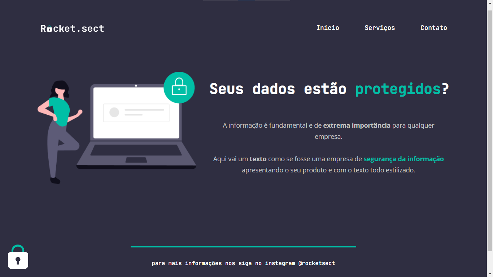

<h1 align="center">
  Rocket Sect - Landing Page 
</h1>

  <a href="#-tecnologias">Tecnologias</a>&nbsp;&nbsp;&nbsp;|&nbsp;&nbsp;&nbsp;
  <a href="#-projeto">Projeto</a>&nbsp;&nbsp;&nbsp;|&nbsp;&nbsp;&nbsp;
  <a href="#memo-licença">Licença</a>

  
  

 

## 📖 Descrição

Esta Landing Page faz parte de um desafio proposto no Nível XX do programa Explorer da Rocketseat.
 
O desafio era recriar uma aplicação a partir de um layout.

## 🚀 Tecnologias

Este projeto foi desenvolvido com as seguintes tecnologias:

- HTML
- CSS

## 🚧 Projeto
 

 

## 📝 Licença

Esse projeto está sob a licença MIT. Veja o arquivo [LICENSE](.github/LICENSE) para mais detalhes.

---

Feito com ♥ by Vitoria Nobre
 
